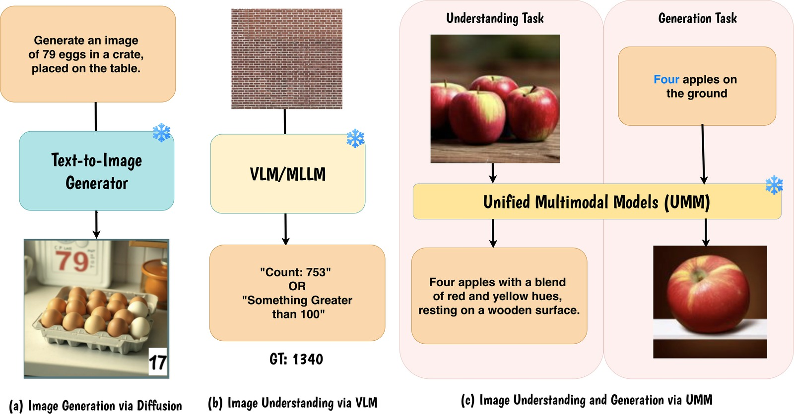
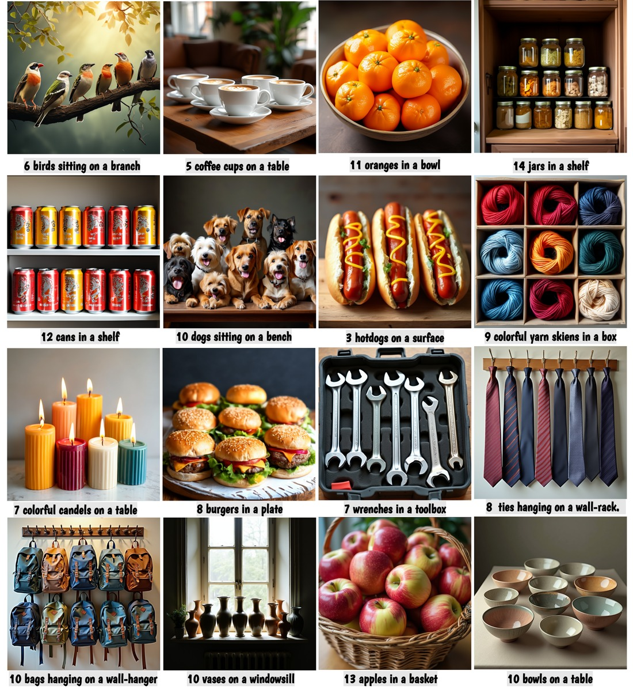
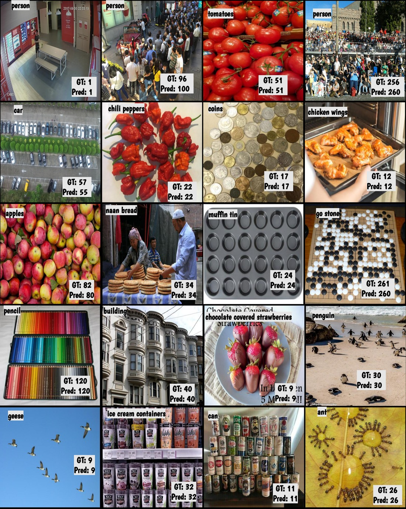

# ABACUS: Adapting Unified Foundation Models for Bridging Image Count Understanding and Generation

<h5 align="center">

[](https://arxiv.org/abs/2606.23835)
[](LICENSE)
<br>
</h5>

<div align="center">
  
</div>

This repository provides the official implementation of **ABACUS**: *Adapting Unified Foundation Models for Bridging Image Count Understanding and Generation*. We have designed a clean, structured, and state-of-the-art codebase for training and evaluating count-accurate multi-modal models.

> **ABACUS: Adapting Unified Foundation Models for Bridging Image Count Understanding and Generation**
>
> [Anindya Mondal*](https://mondalanindya.github.io/)$^1$, [Sauradip Nag*](https://sauradip-nag.github.io/)$^2$, [Anjan Dutta](https://www.surrey.ac.uk/people/anjan-dutta)$^1$
> 
> $^1$ University of Surrey, &nbsp; $^2$ Simon Fraser University
> 
> $^*$ Equal Contribution
> - Primary Contact: Anindya Mondal ( a.mondal@surrey.ac.uk )

---

## 📣 News
- **[2026-06-25]** 🚀 Preprint is released on [arXiv](https://arxiv.org/abs/2606.23835).
- **[2026-06-15]** 🎉 Code, dataset generation scripts, and model checkpoints are officially released.

---

## Overview
- [🤔 Introduction](#-introduction)
- [🚀 Main Results](#-main-results)
- [🛠️ Quick Start](#%EF%B8%8F-quick-start)
- [👍 Acknowledgements](#-acknowledgements)
- [📘 Citation](#-citation)

---

## 🤔 Introduction

ABACUS is a unified VLM built on a 3B-parameter foundation model that simultaneously handles **object counting**, **crowd counting**, **referring-expression counting**, and **count-faithful image generation** — with no benchmark-specific training.

<div align="center">
  
</div>

Three complementary innovations drive the model:
1. **Density-Aware Adaptive Zooming**: Uses an objectness map to identify potential count locations, then crops and processes high-density sub-regions at higher resolution before aggregating counts.
2. **Boundary-Aware Count Policy**: Guided by GRPO reinforcement learning rewards to penalize splits of the same object across crop boundaries, eliminating the systematic double-counting artifact.
3. **Cycle-Consistent GRPO**: Allows the understanding branch to verify whether generated images match the requested count, providing a self-supervised reward signal that bridges the understanding–generation gap with no external labels.

---

## 🚀 Main Results

### 📊 Image Counting & Understanding Benchmarks
ABACUS outperforms task-specific specialists and larger generalist models on counting benchmarks without benchmark-specific tuning.

### 🎨 Count-Faithful Image Generation Benchmarks
ABACUS generates images matching the exact requested count while maintaining naturalistic spatial arrangements without mode collapse.

<div align="center">
  
</div>

### 🔍 Density Zooming and Objectness Grounding
ABACUS can understand any in-the-wild image and count the number of instances mentioned by the user in the prompts.

<div align="center">
  
</div>

---

## 🛠️ Quick Start

### Installation
Create a conda environment and install the required dependencies:
```shell
conda create -n ABACUS python=3.10
conda activate ABACUS
pip install torch==2.5.1+cu118 torchvision==0.20.1+cu118 --index-url https://download.pytorch.org/whl/cu118
pip install -r requirements.txt
pip install -e .
```

### Environment Setup
Run the environment configuration script before running any training or evaluation commands:
```shell
source setup.sh
```
Override defaults by exporting variables beforehand:
```shell
export INTERNVL3_HF_PATH=/your/path/to/InternVL3-1B-hf
export FSC147_PROMPTS=/your/path/to/fsc147_filename_class_count_prompt_qwen3vl.json
source setup.sh
```
### Training and Evaluation 
Coming Soon

## 👍 Acknowledgements
- [UniLIP](https://github.com/nnnth/UniLIP): Base architecture for multimodal understanding and generation.
- [InternVL](https://github.com/OpenGVLab/InternVL): Core vision-language backbone.
- [Sana](https://github.com/NVlabs/Sana): Sana DiT diffusion model.
- [DC-AE](https://github.com/mit-han-lab/efficientvit): Pixel autoencoder module.

---

## 📘 Citation
If you find our work helpful, please consider citing it:
```bibtex
@article{mondal2026abacus,
  title   = {ABACUS: Adapting Unified Foundation Models for Bridging Image Count Understanding and Generation},
  author  = {Mondal, Anindya and Nag, Sauradip and Dutta, Anjan},
  journal = {arXiv preprint arXiv:2606.23835},
  year    = {2026}
}
```
